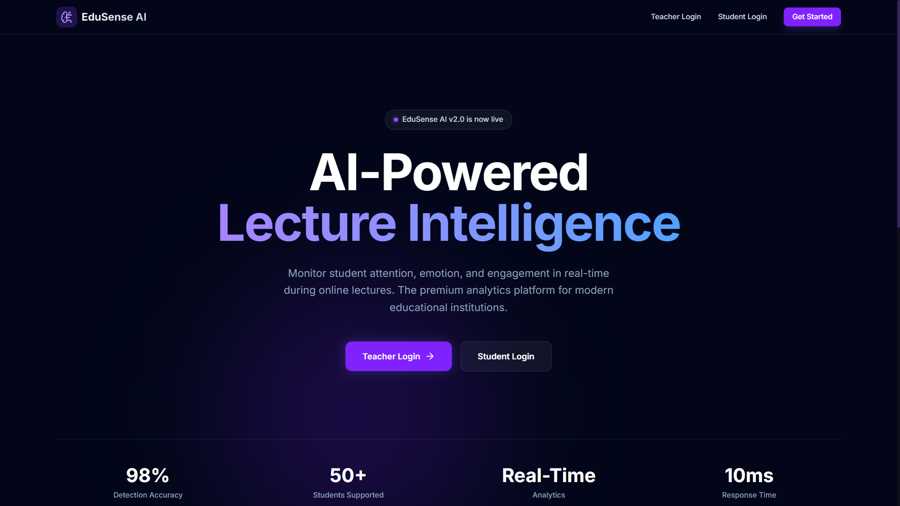
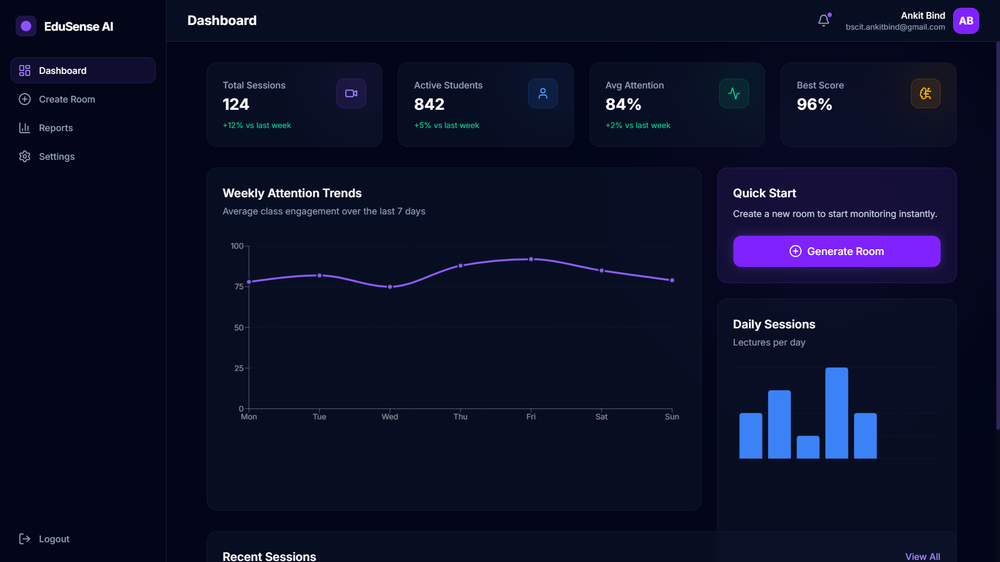
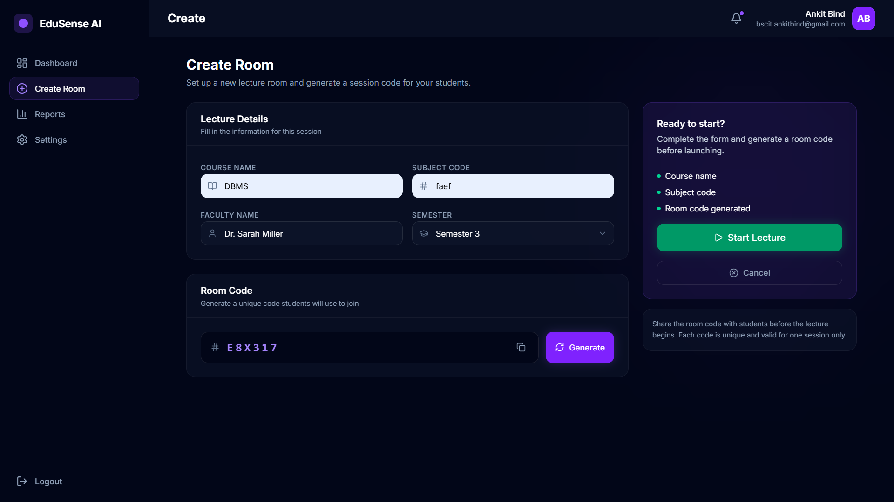
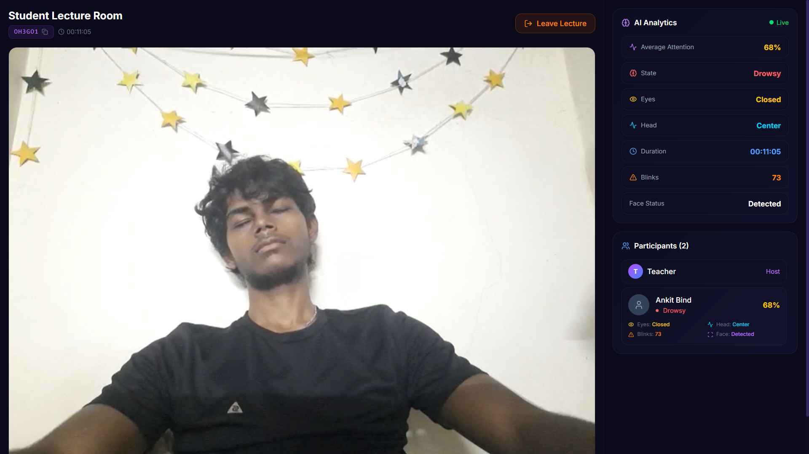
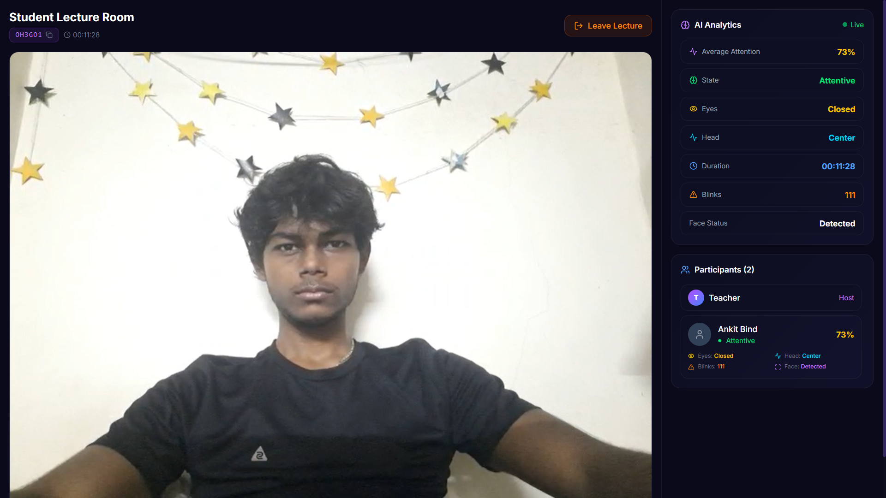
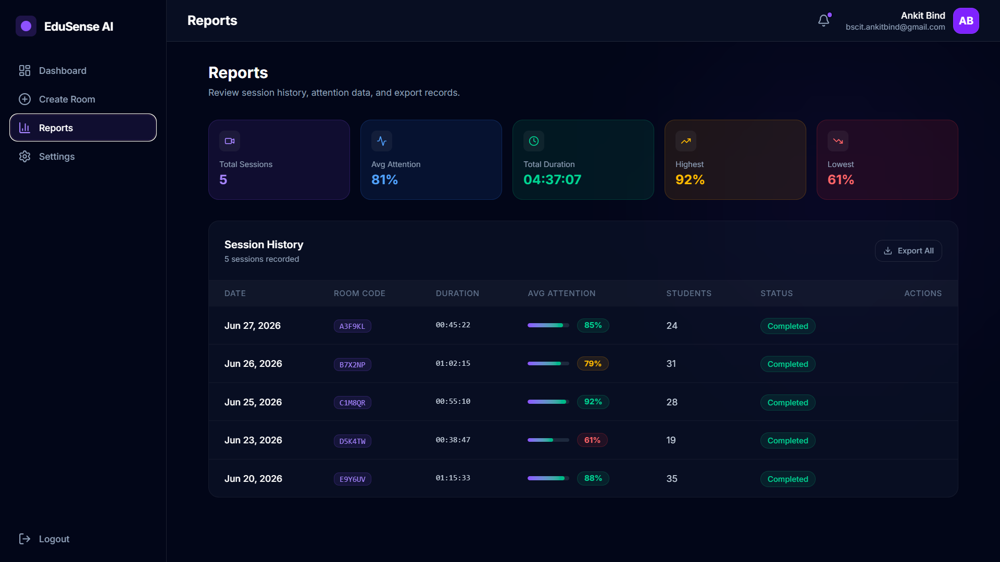
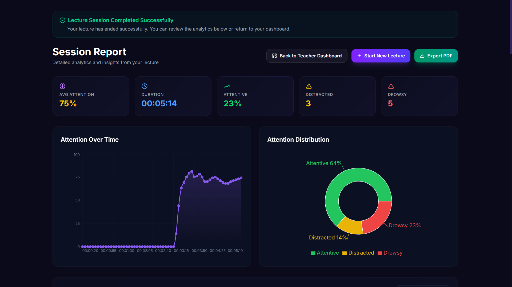
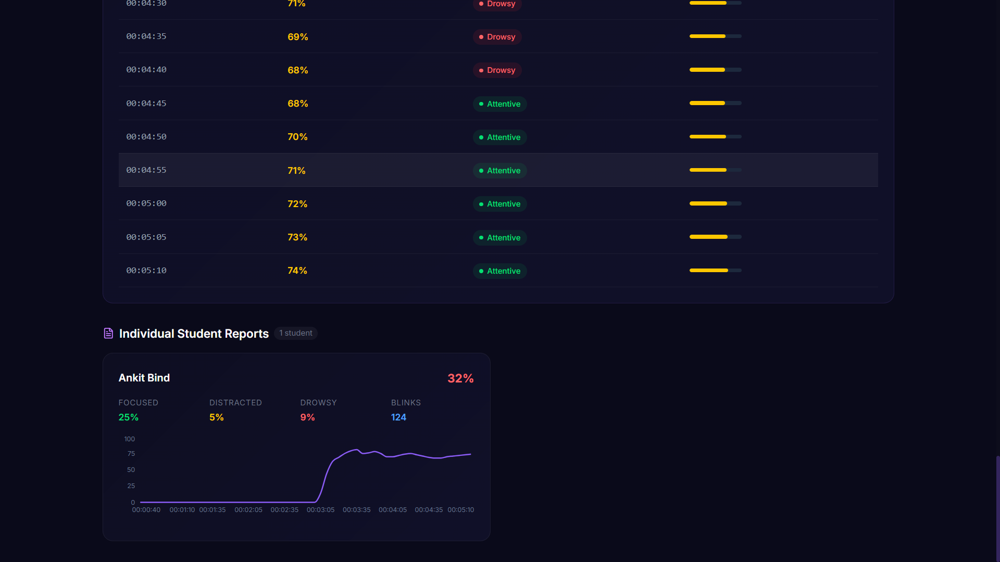

# AI Online Lecture Engagement Monitoring

A full-stack AI-powered web application that analyzes student engagement during live online lectures using real-time computer vision. The system provides educators with actionable insights through facial landmark analysis, attention tracking, live analytics, and comprehensive session reports.

<div align="center">


</div>

---

## Overview

Traditional online learning platforms provide limited visibility into student engagement. This project addresses that challenge by leveraging AI and computer vision to monitor attentiveness in real time using a webcam.

The system detects facial landmarks, eye state, head orientation, blink patterns, and attention levels, enabling instructors to monitor engagement throughout a lecture while generating detailed analytical reports after each session.

---

## Key Features

### AI-Based Attention Monitoring
- Real-time face detection
- Eye open/closed detection
- Head pose estimation
- Blink detection
- Drowsiness detection
- Attention score calculation

### Virtual Classroom
- Secure teacher authentication
- Student room joining
- Unique lecture room generation
- Live participant tracking
- Real-time communication using Socket.IO

### Analytics Dashboard
- Live engagement monitoring
- Average attention scoring
- Student-wise analytics
- Session timeline visualization
- Blink statistics
- Attendance duration

### Report Generation
- Automatic lecture reports
- Student performance summary
- Attention history
- PDF export
- MongoDB report storage

---

# System Architecture

```text
                  Student Webcam
                         │
                         ▼
              MediaPipe Face Detection
                         │
                         ▼
          AI Attention Analysis Engine
                         │
                         ▼
        React Frontend + Socket.IO Client
                         │
          ┌──────────────┴──────────────┐
          ▼                             ▼
    Express REST API             Socket.IO Server
          │                             │
          └──────────────┬──────────────┘
                         ▼
                  MongoDB Atlas
```

---

# Technology Stack

## Frontend

- React 19
- Vite
- Tailwind CSS
- Axios
- Socket.IO Client
- Chart.js
- Recharts
- jsPDF

## Backend

- Node.js
- Express.js
- MongoDB Atlas
- Mongoose
- JWT Authentication
- Socket.IO
- bcrypt

## AI / Computer Vision

- MediaPipe Face Landmarker
- Facial Landmark Detection
- Head Pose Estimation
- Eye State Detection
- Attention Scoring

---

# Project Structure

```text
AI-Online-Lecture-Engagement-Monitoring/

├── frontend/
│   ├── src/
│   ├── public/
│   └── package.json
│
├── backend/
│   ├── config/
│   ├── controllers/
│   ├── middleware/
│   ├── models/
│   ├── routes/
│   ├── socket/
│   └── server.js
│
└── README.md
```

---

# Installation

## Clone Repository

```bash
git clone https://github.com/AnkitBind21/AI-Online-Lecture-Engagement-Monitoring.git

cd AI-Online-Lecture-Engagement-Monitoring
```

---

## Backend

```bash
cd backend
npm install
```

Create a `.env`

```env
MONGO_URI=your_mongodb_uri
JWT_SECRET=your_secret_key
JWT_EXPIRES_IN=7d
CLIENT_URL=http://localhost:5173
PORT=5000
```

Start server

```bash
npm run dev
```

---

## Frontend

```bash
cd frontend

npm install
```

Create `.env`

```env
VITE_API_URL=http://localhost:5000
VITE_SOCKET_URL=http://localhost:5000
```

Start frontend

```bash
npm run dev
```

---

# Application Screenshots

## Home Page

<p align="center">
  
</p>

---

## Teacher Dashboard

<p align="center">
  
</p>

---

## Create Lecture Room

<p align="center">
  
</p>

---

## Live Lecture Monitoring

<p align="center">
  
</p>

---

## AI Attention Analysis

<p align="center">
  
</p>

---

## Analytics & Reports

<p align="center">
  
</p>

---

## Report Generation

<p align="center">
  
</p>

---

## PDF Report Export

<p align="center">
  
</p>

---

# Future Enhancements

- Emotion Recognition
- Mobile Device Support
- Attendance Export
- AI-based Engagement Prediction
- LMS Integration
- Cloud Recording

---

# Live Demo

**Frontend**

>https://ai-online-lecture-engagement-monito.vercel.app/

**Backend API**

> https://ai-online-lecture-engagement-monitoring.onrender.com

---

# Author

**Ankit Bind**

GitHub  
https://github.com/AnkitBind21

LinkedIn  
https://www.linkedin.com/in/ankit-bind-219104299/

---

# License

This project is licensed under the MIT License.

---

<div align="center">

⭐ If you found this project useful, consider giving it a star.

</div>
